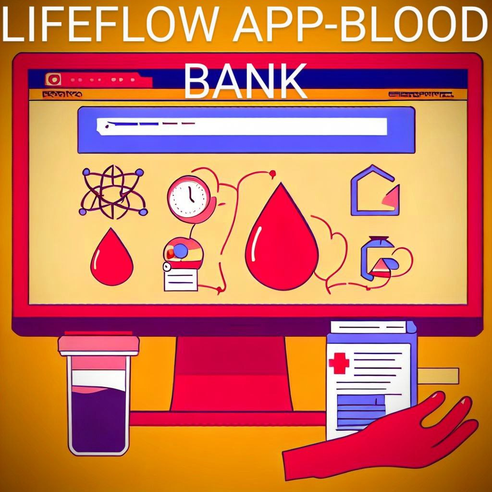

# LifeFlow Application(MERN Stack)

## Introduction
 <!-- If applicable -->

Welcome to the future of blood donation and saving lives – the LifeFlow App, powered by the cutting-edge MERN stack! We believe that every drop of blood counts, and with our user-friendly platform, we're making it easier than ever for donors and recipients to connect seamlessly. In this digital age, we understand the importance of a secure and efficient login and registration system, which is why we've harnessed the power of MERN (MongoDB, Express, React, and Node.js) to bring you a robust and intuitive experience.

LifeFlow App isn't just an application; it's a lifeline. Whether you're a dedicated blood donor looking to make a difference or someone in need of a life-saving transfusion, our platform is designed to bridge the gap between donors and recipients effortlessly.

Our MERN stack technology ensures that you have access to a seamless, responsive, and highly secure environment that makes managing your blood donation journey a breeze. Say goodbye to long queues and frustrating paperwork; LifeFlow App is here to streamline the entire process.

Join us in our mission to save lives, one donation at a time, as we leverage the power of modern technology to make a positive impact on the world. Welcome aboard, and together, let's make a difference with the LifeFlow App!

## Login and Register (Donar,Hospital,Organisation,Admin)

With our state-of-the-art login and registration features, your personal information is protected while ensuring a hassle-free user experience. You can sign up with ease, create your profile, and be on your way to becoming a blood donor or finding a donor when you need it the most.

  
  

  
  

## Features

1.User-friendly Registration.

2.Donor,Hospital,Organisation,Admin Profiles.

3.Blood Requests and Available Blood as per Blood Groups.

4.Donation History and Badges.

5.Health Records Integration(Analytics).

6.Multi-platform Access(Accessible on web browsers, Android, and iOS devices for wider reach).

  
  

## Contributing

Contributions are welcome! If you'd like to contribute to LifeFlow App, follow these steps:

1. Fork the repository.
2. Create a new branch for your feature: `git checkout -b feature-name`
3. Make your changes and commit them: `git commit -am 'Add new feature'`
4. Push your changes to your fork: `git push origin feature-name`
5. Submit a pull request detailing your changes.

Please ensure your code follows the project's coding standards and includes appropriate documentation.

## Deployment on Render - Quick Guide

-Sign Up: Create a Render account here.

-Connect Repository: Link your project's repository (GitHub, GitLab, or Bitbucket).

-Create Web Service: Add a new web service on the Render dashboard.

-Configure Build: Set up build settings or custom configurations if needed.

-Choose Environment: Specify your application's environment (e.g., Node.js, Python).

-Set Up Database: If required, add a Render-managed database.

-Add Environment Variables: Store sensitive information as environment variables.

-Deploy: Click "Save and Deploy" to launch your app.

-Monitor: Keep an eye on your app's performance and logs on the Render dashboard.

-Custom Domains: Configure custom domains if you have them.

-Scale (Optional): Easily adjust resources and instances as your app grows.

-Continuous Deployment (Optional): Set up automatic updates from your Git repository.

## License

This project is licensed under the [MIT License](LICENSE). Feel free to use, modify, and distribute the code as per the terms of the license.

---

Enjoy your journey through the cosmos! Feel free to contact us at deeprahangdale2003@gmail.com for any inquiries or feedback.

